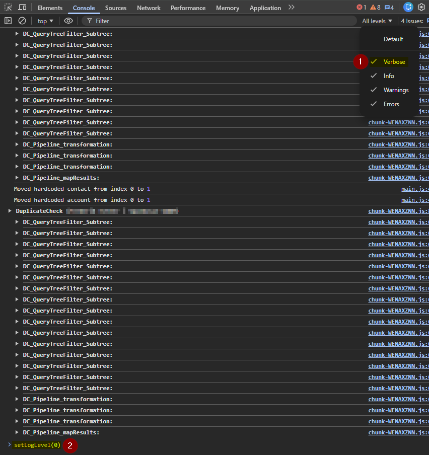
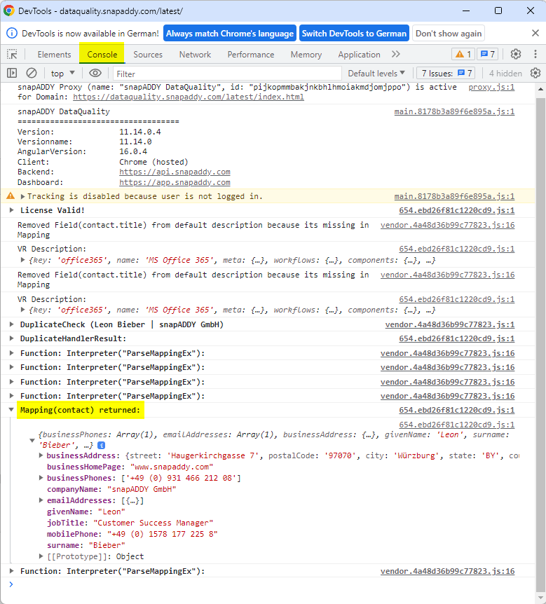

# Debugging

Debugging is very important step in the mapping process. The snapAddy DataQuality has a powerful debug console, that can be opened by pressing [F12] in the DataQuality window. This opens a new DevTool debug console window. Make sure that "Console" is selected in the top row. This will give you useful information about what DataQuality is doing.

When debugging, set the log level to `Verbose` and run `setLogLevel(0)` in the console. This ensures that all log levels are enabled and provides full visibility into the logs.

See screenshot below:

 
You can see what will be exported to the CRM by looking at the "**EntityMapping**" logs. This log will appear as soon as the merge view is opened. Every entity in the mappings should appear in the Console. Expand the log to see what the mapping for the entity returned (**Mapping(entity) returned**). 

See screenshot below:

